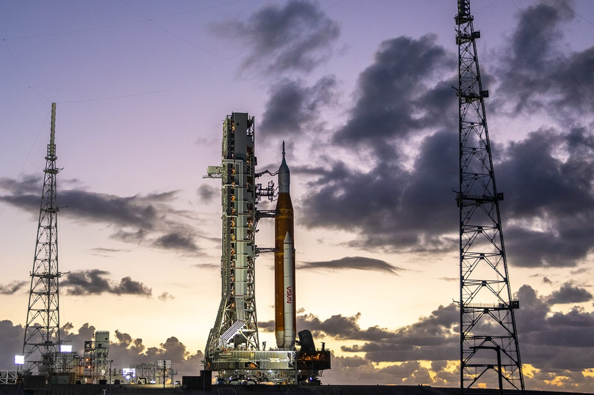

<picture align="center">
  
</picture>

## Recent Side Quests 🕴️

### [40 Hz, Take Two](articles/2026-10-40hz.md)

Gamma light and sound in the browser. Only what your screen can actually show.

 
 

### [Finishing Apple's Background Effect](articles/2026-09-fastbg.md)

Video and live web backgrounds on any call, cut out with macOS's own matte.

 
 

### [Checking the Oil on Claude Code](articles/2026-09-claude-dipstick.md)

Context, usage and cache pressure in one row. One bash file, no dependencies.

 
 

### [Game Tiles for Picky Humans](articles/2026-02-gametile-designer.md)

A vibe-coded tool for designing laser-cut interlocking game tiles.

 
 

### [Your Code Could Fly in Space](articles/2026-02-nasa-open-source.md)

A tour of NASA's open source flight software stack, from orbit to ground control.

 
 

### [GitHub's Fraud Economy](articles/2026-01-starscout.md)

Contributed local execution to StarScout so anyone can investigate fake stars without a cloud budget.

 
 

### [Dynamic GitHub Social Images](articles/2025-01-ghlogo.md)

A Cloudflare Worker that redirects to a repo's current og:image.

 
 

### [Git Merge for Prompts](articles/2025-01-betterprompt.md)

Semantic three-way merge for natural language. No LLM required.

 
 

### [Automating Architecture Diagrams with Claude](articles/2025-01-claude-d2-diagrams.md)

I built a plugin that generates them directly from your infrastructure-as-code.

 
 

